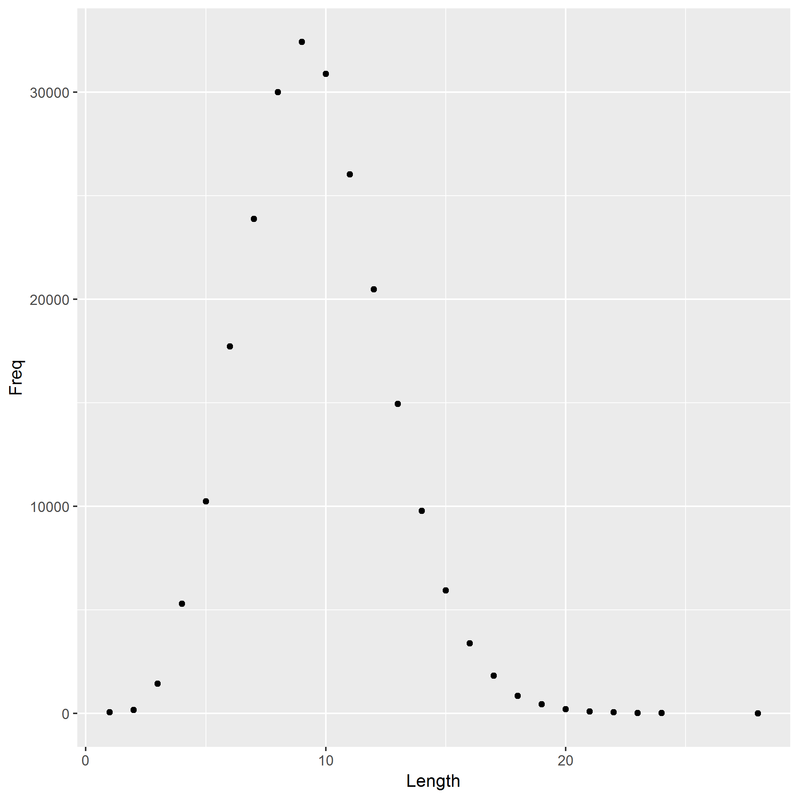

```{r setup, include=FALSE}
knitr::opts_chunk$set(echo = TRUE)
library(tidyverse)
```

## Reads the table of word lengths, reports the most common word length

```{r, warning=FALSE, message=FALSE}
read_tsv("histogram.tsv") %>% 
	arrange(desc(Freq)) %>% 
	head(5)
```
## Displays the pre-made histogram 


